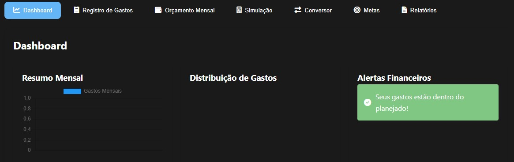

<h1 align="center"> Beu Bolso 💰</h1>

<h4 align="center"><a href="[https://lucyanovidio.vercel.app](https://meu-bolso-lilac.vercel.app/)">Confira o projeto aqui</a></h4>

---

## 💻 Sobre o projeto

Projeto feito no intuito de ajudar o usuário a organizar suas finanças, com funcionalidades importantes.

## 🤯 O site é composto por:

- **Dashboard:** Mostra um resumo da situação financeira;
- **Registro de Gastos:** Onde o usuário adiciona suas despesas;
- **Orçamento Mensal:** Mostra a porcentagem gasta do orçamento mensal;
- **Simulação de Economia:** Simula e mostra dicas de economia;
- **Conversor de Moedas:** Converte o valor das moedas ao redor do mundo;
- **Metas:** Adiciona metas, estimulando a organização financeira;
- **Relatório:** Disponibiliza um relatório das finanças do mês escolhido;

## 🧠 Tecnologias utilizadas:

O site **ainda está em desenvolvimento**, pois estou em constante aprendizado. Mas até aqui utilizei as tecnologias:

    
    
    

## 📚 Alguns conceitos aplicados

Neste projeto apliquei os seguintes pontos:
+ Semântica HTML;
+ Pontos de acessibilidade;
+ Responsividade.
  

---

<table>
  <tr>
    <td>
      
    </td>
    <td>
      Feito por <a href="https://github.com/codebydavidd">David Nathan.</a>😁
    </td>
  </tr>
</table>
